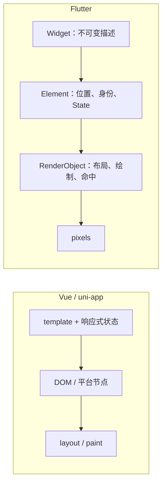

# 别把 Flutter 当成“没有 HTML 的 Vue”

## 给 `uniapp-match-driver` 开发者的 Flutter 项目速通课

> 目标不是让你背完几百个 Widget，而是把你已经掌握的 HTML / CSS / JavaScript / Vue / uni-app 能力，翻译成 Flutter 的心智模型；然后以你熟悉的 `uniapp-match-driver` 和正在面对的 `flutter_match_driver` 为教材，做到能读代码、能改需求、能排错、能写可维护的新功能。

---

## 先说实话：一篇文章不能把人瞬间变成高级工程师

但它能做一件非常值钱的事：让你跳过最痛苦的“概念错位”。

你现在看不懂 Flutter，多半不是因为你不会前端，而是因为你一直在用浏览器的规则解释一个没有 DOM、没有 CSS 级联、自己负责布局和绘制的 UI 框架。只要翻译器装对，你已有的大量能力都能继续使用：组件化、响应式、状态提升、单向数据流、类型建模、异步请求、路由守卫、设计系统、性能分析、工程化和测试。

读完并实践后，你应当能做到：

- 看懂 Widget 树以及 `view.dart` / `logic.dart` 的分工。
- 根据设计稿写出不溢出的 Flutter 布局。
- 理解项目里的 GetX：`GetBuilder`、`Obx`、`.obs`、`update()`、路由和依赖注入。
- 顺着“页面 → Controller → API Service → HTTP”追踪一条业务链路。
- 正确处理表单、分页、异步、生命周期、资源释放和错误状态。
- 判断何时只用 `setState`，何时用 GetX，何时需要 Repository。
- 写 unit / widget / integration test，并用 DevTools 根据证据排性能问题。
- 知道从“能写页面”到“高级 Flutter 开发者”还要补哪些真实能力。

### 这篇课怎么读

第一遍只读到第 8 章，目标是“突然看懂”。第二遍把两个项目同时打开，照着“真实文件对照表”逐个跳转。第三遍完成最后的 30 天训练，不要只看不写。

---

## 0. 版本基线：最新版本与当前项目不是一回事

截至 2026-08-14，Flutter 最新 stable 是 **3.47.0**，内置 Dart **3.13.0**；但 `flutter_match_driver` 的 README 记录的项目开发版本是 Flutter **3.32.8**，`pubspec.yaml` 的 Dart SDK 约束从 **3.8.1** 起。

所以本文采用两条原则：

1. 正文代码优先兼容你当前项目，避免使用 Dart 3.13 刚加入、项目可能无法编译的新语法。
2. 架构、测试、性能和新 API 方向按当前官方建议讲；需要升级才能用的内容会明确标注。

这也是高级开发者必须养成的习惯：**先确认项目版本，再阅读对应 API；不要把“网上最新写法”直接粘进旧项目。**

官方版本来源：[Flutter Windows releases manifest](https://storage.googleapis.com/flutter_infra_release/releases/releases_windows.json)。Flutter 官方多数教程页面目前仍标注基于 3.44.7，这不影响其中的核心架构原则。

---

## 1. 先把这三句话刻进脑子

### 1.1 UI 是状态的函数

```text
UI = f(state)
```

在命令式 DOM 写法中，你可能会：

```js
title.textContent = '已接单'
button.classList.add('disabled')
```

Flutter 的思路是：把状态改成“已接单”，然后重新描述在这个状态下 UI 应该长什么样。框架负责把旧画面更新到新画面。

```dart
if (order.isAccepted) {
  return const Text('已接单');
}
return FilledButton(onPressed: accept, child: const Text('接单'));
```

你在 Vue 中其实早就在这么做：`ref` 改变后，模板根据状态重新计算。Flutter 和 Vue 的共同点是声明式 UI；区别在于 Vue 最终操作浏览器 DOM，而 Flutter 最终生成自己的布局、绘制和合成对象。

### 1.2 Widget 不是 DOM 节点

Widget 是**不可变的 UI 配置对象**。它可以很便宜地频繁创建。真正保存树中位置、身份以及 StatefulWidget 状态的是 Element；真正参与测量、布局、绘制、命中测试的是 RenderObject。



因此：

- `build()` 再执行，不等于整屏 DOM 被销毁。
- 创建很多短命 Widget，不等于底层渲染对象全部重建。
- `const` 有价值，但“看到 new Widget 就害怕”是错误心智。
- Key 的作用接近 Vue 的 `:key`：帮助框架在同级节点重排时识别身份。

官方解释：[Flutter architectural overview](https://docs.flutter.dev/resources/architectural-overview)。

### 1.3 Flutter 布局只有一句总纲

> Constraints go down. Sizes go up. Parent sets position.  
> 约束向下传，尺寸向上传，位置由父级决定。

父 Widget 告诉子 Widget：“你的宽最少多少、最多多少，高最少多少、最多多少。”子 Widget 只能在约束内选择尺寸，再把尺寸报告回去，最后由父级决定它摆在哪里。

这与浏览器“元素先有内容和 CSS，然后参与文档流”的直觉不同。绝大多数 Flutter overflow、无限高度、`width` 不生效问题，都能用这句话解释。

官方必读：[Understanding constraints](https://docs.flutter.dev/ui/layout/constraints)。

---

## 2. 你的 Web / uni-app 知识如何翻译成 Flutter

| 你熟悉的概念 | Flutter 对应物 | 关键差异 |
|---|---|---|
| Vue SFC / 页面组件 | Widget 类 + `build()` | 样式和结构通常通过 Widget 组合表达 |
| `<template>` | `build(BuildContext)` 返回的 Widget 树 | `build` 可频繁执行，必须快、无副作用 |
| `<view>` / `<div>` | 没有唯一对应物 | 可能应是 `Padding`、`Row`、`Column`、`Align`、`SizedBox`、`DecoratedBox` 或 `Container` |
| props | Widget 构造函数参数 + `final` 字段 | 有完整静态类型检查 |
| emit / callback prop | `VoidCallback`、`ValueChanged<T>` 等回调 | 由父级传入函数 |
| slot | `child`、`children`、`WidgetBuilder` | 命名 slot 常变为多个命名 Widget / builder 参数 |
| `v-if` | collection-if 或普通 `if` 返回不同 Widget | UI 本身就是 Dart 表达式 |
| `v-for` | collection-for / `ListView.builder` | 长列表要懒构建，并提供稳定 Key |
| `ref()` | 局部字段、`ValueNotifier`、GetX 的 `.obs` | 选择取决于状态生命周期和共享范围 |
| `computed()` | Dart getter，或 GetX 中基于 Rx 计算的 getter | 不要重复保存可推导状态 |
| `watch()` | Worker、listener、生命周期内订阅 | 必须关注取消订阅和副作用 |
| Pinia Store | GetxController / GetxService / ViewModel / Repository | Store 工具不是架构本身 |
| `@click` | `onPressed` / `onTap` | 按钮优先使用带语义的 Button，而非所有点击都用 GestureDetector |
| CSS Flexbox | `Row` / `Column` / `Flex` | `Expanded` 近似 `flex-grow: 1` |
| flex-wrap | `Wrap` | 大量项目仍应使用 Grid/List builder |
| `position: absolute` | `Stack` + `Positioned` | `Positioned` 必须是 Stack 的直接子级 |
| `overflow: auto` | `ListView` / `CustomScrollView` | 滚动区必须获得有限尺寸 |
| media / container query | `MediaQuery.sizeOf` / `LayoutBuilder` | 优先按可用空间分支，不按设备型号分支 |
| CSS 变量 / UnoCSS theme | `ThemeData` / `ThemeExtension` | 通过 context 在 Widget 树中读取主题 |
| `rpx` / rem | 逻辑像素 + 约束布局；项目另用了 ScreenUtil | 缩放数字不能替代真正的自适应布局 |
| `onLoad` / `onShow` | `initState`、路由返回、生命周期 observer；GetX 的 `onInit` / `onReady` | 生命周期语义并不一一相等 |
| `onUnmounted` | `dispose()` / GetX `onClose()` | Controller、FocusNode、订阅、Timer 等要释放 |
| `uni.navigateTo` | `Navigator.push` 或项目里的 `Get.toNamed` | 移动端是页面栈，还要处理返回、深链和恢复 |
| Promise | `Future<T>` | 单次异步结果 |
| EventSource / Observable | `Stream<T>` | 随时间产生多个结果 |
| Web Worker | Isolate / `compute` | I/O 异步不等于 CPU 并行 |
| `package.json` | `pubspec.yaml` | 同时声明依赖、assets、fonts 等 |
| HMR | Hot reload | 通常保留 State，不会重跑 `initState` |
| Vitest component test | Flutter widget test | 可真实执行布局、点击、输入和帧推进 |

官方也有专门面向 Web 开发者的对照页：[Flutter for web developers](https://docs.flutter.dev/flutter-for/web-devs)。

---

## 3. 两个真实项目，就是你的教材

下面不要“泛泛地学 Flutter”，而是把同一业务在两端的实现并排读。

| 学习主题 | `uniapp-match-driver` | `flutter_match_driver` | 你要看懂什么 |
|---|---|---|---|
| 应用入口 | `src/main.ts`、`src/App.vue`、`pages.config.ts` | `lib/main.dart`、`lib/pages/app_route_names.dart` | 根组件、全局配置、路由表、初始化 |
| 页面外壳 | `src/subs/common/components/wl-page-view/index.vue` | 页面中的 `Scaffold`、`SafeArea`、`appBar/body/bottomNavigationBar` | slot、滚动区、固定底栏与安全区怎样翻译 |
| 自定义底栏 | `src/tabbar/index.vue`、`src/tabbar/store.ts` | `lib/pages/tabbar/view.dart`、`logic.dart` | reactive / computed 如何变成 Obx / GetBuilder；页面缓存 |
| 首页 | `src/pages/home/index.vue`、`src/subs/home-goods/home/components/home.vue` | `lib/pages/home_page/view.dart`、`logic.dart` | 页面拆分、生命周期、列表、状态组合 |
| 货源大厅 | `src/subs/home-goods/goods/components/goods-hall/index.vue` | `lib/pages/home_page/freight_hall_home/freight_hall/view.dart`、`logic.dart` | 分页、筛选、`Promise.all/Future.wait`、刷新、回顶和卡片列表 |
| 货源搜索 | `src/subs/home-goods/search/index.vue` | `lib/pages/search_freight/view.dart`、`logic.dart` | 搜索框、历史记录、条件展示、用户事件 |
| 搜索结果与分页 | 同一 Vue 文件中的 `non-fixed-paging` 和 `getGoodsList` | `search_result_list/view.dart`、`logic.dart` | 分页 Controller、筛选、刷新、空状态 |
| 货源详情 | `src/subs/home-goods/goods/goods-details/index.vue`、对应 Pinia Store | `lib/pages/freight_detail/view.dart`、`logic.dart` | `storeToRefs` 与 Rx、路由参数、详情请求、局部更新 |
| 货源筛选 | `src/subs/home-goods/goods/goods-filter/index.vue`、对应 Store | `lib/pages/freight_filter/view.dart`、`logic.dart` | 草稿状态、回填、校验、网格选择和带结果返回 |
| 报价弹层 | `goods-details/components/quote-sheet/index.vue` | `lib/pages/freight_detail/dialog_page/make_price_dialog.dart` | `v-model`、emit 如何变成 Sheet 的 Future、回调和表单状态 |
| 货源 API | `src/subs/home-goods/api/goods/goods-list/index.ts` | `lib/pages/home_page/freight_hall_home/freight_api_service.dart` | Promise/Future、泛型模型、参数组装、JSON 转换 |
| 实名表单 | `src/subs/auth/page/id-card/index.vue` | `lib/pages/certification/identity_verification/view.dart`、`logic.dart` | 表单状态、Controller、FocusNode、底部操作区、释放资源 |
| 路由和登录拦截 | `src/router/interceptor.ts` | `GetMaterialApp(getPages: Routes.pages)` 及各模块 `routes.dart` | 路由守卫、依赖注入、参数和返回值 |
| 主题 | `src/static/styles/theme.scss`、`uno.config.ts` | `lib/store/theme/app_color.dart`、`theme_controller.dart` | CSS token 如何变成 ThemeExtension |
| 网络基础层 | `src/service/index.ts` | `lib/api/api_service.dart`、`api_service_dio.dart` | token、错误、loading、超时、解码与取消 |

建议在 IDE 中建立一个两列工作区：左边 Vue，右边 Dart。以后每看一个 Flutter 文件，先问：“在 uni-app 里这段责任属于 template、composable、store、router 还是 service？”

最值得完整走一遍的真实业务主线不是计数器，而是：

```text
货源大厅列表 → 点击卡片 → 路由传参 → 详情 Controller
             → 筛选页返回结果 → 报价 BottomSheet → 网络提交
```

它会一次覆盖列表、状态、路由、表单、弹层、网络和生命周期。两端工程并非教科书式一一对应，尤其 Flutter 项目同时存在 `Obx`、`GetBuilder`、`StatefulWidget` 以及多种路由组织方式；这不是你理解错了，而是一个真实项目演进后的样子。先读懂现状，再让新代码逐步统一。

---

## 4. 只学这 20% 的 Dart，就足够开始写 80% 的 Flutter

### 4.1 变量：`var`、`final`、`const`

```ts
let page = 1
const pageSize = 10
```

```dart
var page = 1;            // 可重新赋值，类型推断为 int
final pageSize = 10;     // 运行时只赋值一次
const maxPageSize = 50;  // 编译期常量
```

注意：`final List<int> items = []` 表示 `items` 这个引用不能指向另一份 List，但这份 List 仍可能被 `add()` 修改。真正的不可变性需要不可变对象、只读暴露或复制更新策略。

### 4.2 Null safety

```dart
String title = '货源'; // 不能是 null
String? remark;       // 可以是 null

final length = remark?.length ?? 0;
```

不要靠大量 `!` 逃避空值处理：

```dart
final userName = user!.name; // 编译器闭嘴了，运行时仍可能崩
```

更好的做法是提前返回、模式匹配、默认值，或者从数据模型上表达真实状态。

### 4.3 命名参数，就是更强的 options object

```dart
class FreightCard extends StatelessWidget {
  const FreightCard({
    super.key,
    required this.title,
    required this.onTap,
    this.highlighted = false,
  });

  final String title;
  final VoidCallback onTap;
  final bool highlighted;

  @override
  Widget build(BuildContext context) {
    return ListTile(
      title: Text(title),
      selected: highlighted,
      onTap: onTap,
    );
  }
}
```

这相当于有类型的 props：

```vue
<FreightCard :title="item.title" :highlighted="item.isRead" @click="open(item)" />
```

### 4.4 List / Map 与模板内控制流

```dart
final children = <Widget>[
  const Text('筛选条件'),
  if (hasAddressFilter) const Chip(label: Text('已选地址')),
  for (final item in items)
    FreightCard(
      key: ValueKey(item.id),
      title: item.title,
      onTap: () => open(item),
    ),
];
```

这就是 `v-if`、`v-for` 和 `:key` 进入 Dart 表达式之后的样子。

### 4.5 Future、async/await

```dart
Future<List<Freight>> fetchFreights(int page) async {
  try {
    final json = await client.get('/freights', query: {'page': page});
    return (json as List<dynamic>)
        .map((item) => Freight.fromJson(item as Map<String, dynamic>))
        .toList();
  } catch (error, stackTrace) {
    Error.throwWithStackTrace(FreightLoadException(error), stackTrace);
  }
}
```

JS 开发者要记住：

- `Future<T>` 近似 `Promise<T>`。
- `Stream<T>` 表示多次到来的值，不是 Promise。
- `await` 不会自动把 CPU 重任务放到后台线程。
- 不要在 `build()` 中发请求，因为 `build()` 可能执行很多次。
- 不要写 `items.forEach((item) async { ... })` 并期待外层等待；需要顺序等待时使用普通 `for`。

### 4.6 Dart 与 JavaScript 最容易混淆的地方

- Dart 没有 JS 式 truthy/falsy；条件必须是 `bool`。
- `dynamic` 等于主动关闭静态检查，不能把它当默认类型。
- `final` 不等于对象深度不可变。
- `const` 不只是性能提示，它表示整个表达式可在编译期确定。
- `String?` 与 `String` 是不同类型。
- 命名参数调用使用 `name: value`，不是 JS object literal。
- 私有成员以 `_` 开头，私有范围是 library，而不是 class。
- 文件名通常使用 `lowercase_with_underscores.dart`。

先不要被 mixin、extension type、宏或代码生成吓到。项目开发中遇到再学；入门阶段先熟悉 class、泛型、Future、集合和 null safety。

---

## 5. 把你熟悉的“货源搜索页”翻译成 Flutter

`uniapp-match-driver/src/subs/home-goods/search/index.vue` 的核心结构是：

```vue
<SearchBox @search="handleSearch" />
<HistoryRecord v-if="!showList && isStoreHistory" @search="handleSearch" />
<non-fixed-paging v-show="showList" :request="getGoodsList">
  <template #scrollTop><FilterBox @change="handleFilterChange" /></template>
  <template #default="{ item }"><GoodsItem :item="item" /></template>
  <template #empty><WlEmpty title="没搜到符合条件的货源～" /></template>
</non-fixed-paging>
```

同一责任在 `flutter_match_driver/lib/pages/search_freight/view.dart` 和 `search_result_list/view.dart` 中大致是：

```dart
Column(
  children: [
    buildHeaderRow(logic),
    Expanded(
      child: Obx(
        () => Opacity(
          opacity: logic.showHistory.value ? 0 : 1,
          child: SearchResultListPage(),
        ),
      ),
    ),
  ],
)
```

以及：

```dart
Column(
  children: [
    FilterFreightBar(callback: logic.filterFreight),
    Expanded(
      child: buildRefreshListWidget<FreightDataModel, SearchResultListLogic>(
        itemBuilder: (item, index) => FreightInfoItem(model: item),
        enablePullUp: true,
        enablePullDown: true,
        emptyText: '没搜到符合条件的货源',
      ),
    ),
  ],
)
```

逐项翻译：

| Vue | Flutter |
|---|---|
| `SearchBox @search` | `SearchBarWidget(onSearch: logic.search)` |
| `v-if="!showList"` | `Obx` 中根据 `showHistory.value` 选择显示状态 |
| `FilterBox @change` | `FilterFreightBar(callback: logic.filterFreight)` |
| scoped slot `{ item }` | `itemBuilder: (item, index) => ...` |
| `GoodsItem` | `FreightInfoItem` |
| `non-fixed-paging` | `PagingController` + `buildRefreshListWidget` |
| `getGoodsList(pageNo, pageSize)` | `loadData(int page)` |
| `ref` / `computed` | `.obs` / getter / Controller 字段 |

### 5.1 `child`、`children` 和 `builder`

Flutter 代码看起来括号多，是因为结构、布局和样式都是对象组合：

- `child:`：一个子 Widget，类似单个默认 slot。
- `children:`：多个子 Widget，类似默认 slot 的节点数组。
- `builder:`：把构建时才知道的数据传入回调，类似 scoped slot / render prop。
- 命名参数：天然承担命名 slot 和配置项的角色。

读 Flutter 嵌套时，不要逐个数右括号。按“谁拥有谁”折叠：

```text
Scaffold
└── SafeArea
    └── Column
        ├── SearchHeader
        └── Expanded
            └── SearchResultList
```

### 5.2 为什么一定要有 `Expanded`

`Column` 在竖轴上把可用空间分给子项。搜索头部先取得自身高度，结果列表再用 `Expanded` 占据剩余高度。没有它时，滚动列表会拿到无限高度约束，常见报错就是 viewport 获得 unbounded height。

Web 类比虽然是 `flex: 1; overflow: auto`，但真正要记的是约束模型，不是机械背诵映射。

---

## 6. Flutter 布局：前端转型的第一道真正门槛

### 6.1 常用 CSS → Widget 映射

| CSS 意图 | Flutter |
|---|---|
| `display:flex; flex-direction:row` | `Row` |
| `display:flex; flex-direction:column` | `Column` |
| `justify-content` | `mainAxisAlignment` |
| `align-items` | `crossAxisAlignment` |
| `flex:1` | `Expanded` |
| 可收缩但不强占全部 | `Flexible` |
| `gap` | `SizedBox`，项目里的 `gapH/gapW` 扩展，或 separatorBuilder |
| `padding` | `Padding` / Container 的 padding |
| `margin` | 外层 `Padding` / Container 的 margin |
| background / border / radius / shadow | `DecoratedBox` / `BoxDecoration` |
| width / height | `SizedBox` / constraints |
| `max-width` | `ConstrainedBox(BoxConstraints(maxWidth: ...))` |
| `position:relative/absolute` | `Stack` / `Positioned` |
| `flex-wrap:wrap` | `Wrap` |
| `overflow:auto` 长列表 | `ListView.builder` / `ListView.separated` |
| 多个滚动区协调 | `CustomScrollView` + Sliver |
| container query | `LayoutBuilder` |

### 6.2 五个最常见的报错，怎么想

#### Column 里直接放 ListView

错因：ListView 想在滚动方向获得有限视口，但 Column 可能给它无限高度。

```dart
Column(
  children: [
    const SearchHeader(),
    Expanded(child: ListView.builder(/* ... */)),
  ],
)
```

#### Row 里的长文本溢出

错因：Row 先让非 flex 子项按自身需求测量，文字没有获得可换行的有限宽度。

```dart
Row(
  children: [
    const Icon(Icons.local_shipping),
    const SizedBox(width: 8),
    Expanded(child: Text(longAddress)),
  ],
)
```

#### 设置 `width: 100` 但不生效

父级如果给出 tight constraint，子级不能违抗。先向上检查谁给了约束，而不是继续叠加 SizedBox。

#### `Expanded` 放错父级

`Expanded` 只应作为 `Row`、`Column` 或 `Flex` 的后代，并通过只传递 ParentData 的 Widget 直接到达它们。看到 `Incorrect use of ParentDataWidget`，先检查层级。

#### ScrollView 套同方向 ListView

这通常同时带来无限高度、滚动冲突和一次性构建。优先合并成一个 ListView，或者使用 Sliver；不要先用 `shrinkWrap: true` 把报错压下去。

### 6.3 自适应不是把所有数字乘 `.w` / `.h`

`flutter_match_driver` 使用 `flutter_screenutil`，所以你会看到 `16.w`、`20.h`、`14.sp`。这对按设计基准做尺寸换算有帮助，但不能回答这些问题：

- 横屏时是单列还是双列？
- 平板和折叠屏如何利用额外空间？
- Web 窗口缩放时内容最大宽度是多少？
- 大字体用户是否仍能看全内容？

真正的响应式分支应根据可用约束：

```dart
LayoutBuilder(
  builder: (context, constraints) {
    if (constraints.maxWidth < 720) {
      return const FreightListLayout();
    }
    return const FreightMasterDetailLayout();
  },
)
```

不要先判断 `isTablet`；先问当前组件实际有多少空间。

### 6.4 布局问题五步排查法

1. 用 Flutter Inspector 点中出问题的 Widget。
2. 查看它收到的 min/max width/height constraints。
3. 向上找第一个给出无限约束或过紧约束的父级。
4. 明确谁负责滚动、谁负责占剩余空间、谁负责定位。
5. 只修改负责这件事的那一个布局 Widget。

---

## 7. 状态管理：先理解状态，再理解 GetX

### 7.1 状态先按生命周期分类

| 状态 | 例子 | 推荐拥有者 |
|---|---|---|
| 局部临时 UI 状态 | 密码是否可见、展开/收起、动画进度 | `StatefulWidget + setState` 或 ValueNotifier |
| 页面状态 | 搜索词、筛选、loading、结果、错误 | 页面 ViewModel / GetxController |
| 跨页面会话状态 | 当前用户、token、主题、未读数 | 应用级 Store / Service |
| 持久数据 | 搜索历史、草稿、离线缓存 | Repository / 本地数据服务 |
| 服务端状态 | 货源列表、分页、刷新、缓存、重试 | Repository + ViewModel |

工具选择必须排在状态边界之后。Riverpod、Bloc、GetX、Provider 不是能力等级；能说清楚“谁拥有状态、谁能修改、谁订阅、何时销毁”才是能力。

### 7.2 Pinia / Composition API → GetX

在 Vue 中：

```ts
const keyword = ref('')
const showList = computed(() => keyword.value.length > 0)

function search(value: string) {
  keyword.value = value.trim()
}
```

GetX 的响应式写法：

```dart
class SearchController extends GetxController {
  final keyword = ''.obs;

  bool get showList => keyword.value.isNotEmpty;

  void search(String value) {
    keyword.value = value.trim();
  }
}

Obx(() {
  return controller.showList
      ? const SearchResultList()
      : const SearchHistory();
})
```

`Obx` 会订阅其 builder 执行期间读取的 Rx 值，像一个很轻的响应式 effect。

### 7.3 `Obx` 与 `GetBuilder` 不要混成一团

`flutter_match_driver` 同时使用二者：

- `Obx`：值是 `.obs` / `Rx<T>`，赋值后自动触发订阅它的区域。
- `GetBuilder<T>`：普通字段改变后，Controller 手动调用 `update()`；还可以用 ID 精准更新局部。

```dart
class FreightLogic extends GetxController {
  final sortKey = 'time'.obs; // 给 Obx
  List<Freight> items = [];   // 给 GetBuilder

  Future<void> load() async {
    items = await repository.fetch();
    update(['list']);
  }
}

GetBuilder<FreightLogic>(
  id: 'list',
  builder: (logic) => FreightList(items: logic.items),
)
```

选择标准：

- 单个高频、天然可观察的值，可用 Rx + Obx。
- 一次业务操作会成组更新多个字段，GetBuilder + 明确 ID 往往更直观。
- 同一个状态不要既靠 Rx 自动通知，又到处手动 `update()`。
- 不要让一个页面根部 Obx 读取所有状态，导致整页重建。

### 7.4 Controller 可以看作 ViewModel，但不是 Repository

在现有 Flutter 项目里，`view.dart` 负责 Widget，`logic.dart` 中的 GetxController / PagingController 负责页面状态和事件，它们实际上承担了 ViewModel 的角色。

但是 Controller 不应该自动变成网络层、缓存层、埋点层和所有业务的垃圾桶。更清楚的流向是：

```text
用户操作
  ↓
View（Widget）
  ↓ 调用命令
GetxController / ViewModel
  ↓
Repository（需要单一数据源、缓存、重试时）
  ↓
Service（HTTP、数据库、插件）
```

`flutter_match_driver` 的若干功能目前是 Controller 直接调用 `FreightApiService`。这在简单读取场景可以工作；当出现网络与本地缓存合并、离线优先、多个页面共享数据、刷新策略或复杂错误恢复时，再引入 Repository 才真正有收益。

官方当前强烈建议分离 UI/Data、采用 View/ViewModel 与 Repository/Service；但并没有规定必须使用某个状态管理包：[Architecture recommendations](https://docs.flutter.dev/app-architecture/recommendations)。

---

## 8. 生命周期、BuildContext 和 Key：看懂“为什么有时会莫名其妙”

### 8.1 StatelessWidget 与 StatefulWidget

`StatelessWidget`：UI 只由构造参数和树中依赖决定，自己不持有会变化的本地资源。

`StatefulWidget`：Widget 自身仍然不可变；可变字段和资源放在与它关联的 `State` 对象中。Element 负责在 Widget 重建时保住 State。

```dart
class SearchPage extends StatefulWidget {
  const SearchPage({super.key});

  @override
  State<SearchPage> createState() => _SearchPageState();
}

class _SearchPageState extends State<SearchPage> {
  late final TextEditingController _controller;

  @override
  void initState() {
    super.initState();
    _controller = TextEditingController();
  }

  @override
  void dispose() {
    _controller.dispose();
    super.dispose();
  }

  @override
  Widget build(BuildContext context) {
    return TextField(controller: _controller);
  }
}
```

### 8.2 生命周期速查

| Flutter State | 用途 |
|---|---|
| `initState` | 创建 Controller、FocusNode、订阅；只调用一次 |
| `didChangeDependencies` | 依赖的 InheritedWidget 改变；可读取 context 依赖 |
| `didUpdateWidget` | 父级给了同位置、同类型但新配置的 Widget |
| `build` | 根据当前状态描述 UI；可能频繁调用 |
| `deactivate` | 暂时从树中移除，也可能被重新挂载 |
| `dispose` | 最终释放资源，之后不能再 setState |

GetX Controller 常见对应：

| GetX | 用途 |
|---|---|
| `onInit` | 初始化字段、发起首次业务加载 |
| `onReady` | 第一帧之后，需要页面已渲染时执行 |
| `onClose` | 释放 Controller 拥有的资源 |

不要硬说 `onShow === onReady`。uni-app 页面显示、Flutter Widget 挂载、App 前后台生命周期和路由返回，是不同维度；要按需求选择 RouteObserver、WidgetsBindingObserver、路由返回 Future 或 Controller 生命周期。

### 8.3 `build()` 必须像纯函数

不要在 `build()` 中：

- 请求接口。
- 创建新的 Future 并交给 FutureBuilder。
- 创建 TextEditingController / AnimationController。
- 修改状态或调用 `update()`。
- 做 JSON 大解析或同步重计算。

`build()` 可以被父级重建、主题改变、屏幕尺寸变化、依赖更新等触发。它必须快、无副作用、可重复。

### 8.4 BuildContext 是“当前 Element 的地址”

`Theme.of(context)`、`Navigator.of(context)`、`MediaQuery.sizeOf(context)` 都是在当前节点向祖先查找能力。

因此：

- context 不是全局 DOM，也不是随便缓存的 service locator。
- 某个 context 只能看到它上方已经存在的 Provider / Theme / Navigator。
- 跨越 `await` 后使用 context，先检查它是否仍挂载。

```dart
final draft = await Navigator.of(context).push<FreightDraft>(route);
if (!context.mounted || draft == null) return;
ScaffoldMessenger.of(context).showSnackBar(
  const SnackBar(content: Text('保存成功')),
);
```

项目里 `Get.context` 很方便，但新代码如果已经拿得到局部 `context`，优先显式传递。这样依赖更清楚、测试更容易，也更少遇到 context 尚未建立或已经失效的问题。

### 8.5 Key 就是身份，不是装饰

Vue 中可重排列表要写 `:key="item.id"`；Flutter 同样：

```dart
ListView.builder(
  itemCount: items.length,
  itemBuilder: (context, index) {
    final item = items[index];
    return FreightCard(
      key: ValueKey(item.id),
      item: item,
    );
  },
)
```

不要对会重排的列表使用 index 充当稳定身份。`GlobalKey` 能跨树访问 State，但成本和耦合更高，只在 Form、特定跨树身份等确有需要的场景使用。

---

## 9. 先暂停：你现在应该已经能读懂一半 Flutter 页面了

遇到一段 Dart UI，按这个顺序读：

1. 找最外层页面骨架：`Scaffold`。
2. 找主轴：`Column`、`Row`、`Stack`、`CustomScrollView`。
3. 找空间分配：`Expanded`、`Flexible`、约束。
4. 找可滚动区域：ListView / Paging Widget。
5. 找状态订阅边界：`Obx`、`GetBuilder`、StatefulWidget。
6. 找用户事件：`onPressed`、`onTap`、`onChanged`。
7. 跳进 `logic.dart` 看事件如何修改状态。
8. 再跳进 API / Service 看数据从哪里来。

不要从第一行 import 开始逐字啃。你读 Vue 也不会先研究所有 import；Flutter 同理。

---

## 10. 异步、网络与分页：把 Promise 链翻译成 Future 链

### 10.1 真实搜索链路对照

uni-app 侧：

```text
SearchBox @search
  → handleSearch
  → bumpListQuery
  → non-fixed-paging 调用 getGoodsList(pageNo, pageSize)
  → goodsApi.getGoodsHallList(data)
  → http.post<T>()
  → uni.request
  → GoodsModel[]
  → GoodsItem
```

Flutter 侧：

```text
SearchBarWidget.onSearch
  → SearchFreightLogic.search
  → SearchResultListLogic.refreshData
  → PagingController 调用 loadData(page)
  → FreightApiService.getFreightHallList(...)
  → requestClient.post<List<FreightDataModel>>(...)
  → fromJsonT
  → FreightDataModel[]
  → FreightInfoItem
```

它们本质上完全一样：用户意图 → 更新查询参数 → 触发分页 → 请求 → 解码强类型模型 → 更新列表 → UI 响应。

### 10.2 TypeScript 泛型响应 → Dart 泛型 + fromJson

uni-app 中的接口：

```ts
const res = await http.post<GoodsModel[]>({
  url: '/goods-order/page-query-order-goods-list',
  data: params,
})
```

Flutter 项目里的同类代码：

```dart
final modelList = await ApiService.requestClient.post<List<FreightDataModel>>(
  freightHallPath,
  data: requestData,
  fromJsonT: (json) => (json as List<dynamic>)
      .map(
        (item) => FreightDataModel.fromJson(
          item as Map<String, dynamic>,
        ),
      )
      .toList(),
);
```

关键不是语法，而是 JSON 在运行时仍然是 `dynamic`；你必须在数据层边界把它变成强类型对象。不要把 `Map<String, dynamic>` 一路传进 Widget。

### 10.3 页面至少要有六种状态

一个生产异步页面不是 `loading ? spinner : list` 就结束了：

```text
initial → loading → data
                 ↘ empty
                 ↘ error → retry
data → refreshing → data / error-with-old-data
```

可以用项目现有 PagingState，也可以用 sealed class 明确建模：

```dart
sealed class LoadState<T> {
  const LoadState();
}

final class LoadInitial<T> extends LoadState<T> {
  const LoadInitial();
}

final class LoadInProgress<T> extends LoadState<T> {
  const LoadInProgress();
}

final class LoadSuccess<T> extends LoadState<T> {
  const LoadSuccess(this.data);
  final T data;
}

final class LoadFailure<T> extends LoadState<T> {
  const LoadFailure(this.error);
  final Object error;
}

Widget buildBody(LoadState<List<Freight>> state) {
  return switch (state) {
    LoadInitial() || LoadInProgress() =>
      const Center(child: CircularProgressIndicator()),
    LoadSuccess(data: final items) when items.isEmpty =>
      const EmptyFreightView(),
    LoadSuccess(data: final items) => FreightList(items: items),
    LoadFailure(error: final error) => ErrorView(error: error),
  };
}
```

这段 sealed class / pattern switch 在 Dart 3.8.1 可用；Dart 3.13 的 primary constructor 不要在当前项目升级前使用。

### 10.4 四条异步保命规则

1. **请求不进 `build()`**：放在 `initState`、`onInit`、ViewModel command 或显式用户事件中。
2. **处理过期结果**：用户连续搜索 A、B，A 后返回时不能覆盖 B；使用取消、请求序号或只接收最新请求。
3. **跨 await 检查生命周期**：Widget 用 `context.mounted` / `mounted`；Controller 销毁后不要继续 update。
4. **资源有始有终**：StreamSubscription、Timer、CancelToken、Controller、FocusNode 都要释放或取消。

你的 Flutter 项目已经有 `RequestCancelMixin`，这就是很好的学习入口：读懂它怎样把 Controller 销毁和 Dio 请求取消关联起来。

### 10.5 I/O 异步不等于 CPU 并行

网络和文件 I/O 在等待时不会阻塞 UI isolate；但大 JSON 解析、图片处理、压缩、加密等 CPU 重任务仍可能卡帧。此时才考虑 isolate / `compute`。不要为了普通 HTTP 请求创建 isolate。

---

## 11. 路由：从 `uni.navigateTo` 到 GetX / Navigator / go_router

### 11.1 先读懂现有项目

uni-app 的 `src/router/interceptor.ts` 为 `navigateTo`、`reLaunch`、`redirectTo`、`switchTab` 等安装拦截器，判断登录状态并跳转登录页。

Flutter 项目的根应用使用：

```dart
GetMaterialApp(
  getPages: Routes.pages,
  initialRoute: HomeRoutes.splash,
  unknownRoute: GetPage(
    name: '/notfound',
    page: () => TabBarPage(),
  ),
)
```

业务页通过 route 常量和 `GetPage` 注册，并可用 Binding 创建 Controller：

```dart
GetPage(
  name: HomeRoutes.searchFreight,
  page: () => SearchFreightPage(),
  binding: BindingsBuilder(
    () => Get.lazyPut(SearchFreightLogic.new),
  ),
)
```

跳转：

```dart
final result = await Get.toNamed(
  HomeRoutes.searchFreight,
  arguments: {'keywords': keyword},
);
```

你可以先把它理解成：

| uni-app | GetX |
|---|---|
| 页面路径 | route name 常量 |
| `uni.navigateTo` | `Get.toNamed` |
| `navigateBack` | `Get.back` |
| query / eventChannel | `arguments` / Future 返回值 |
| 路由拦截器 | middleware / 跳转前统一检查 |
| 页面 store 初始化 | route Binding 注入 Controller |

### 11.2 先学原生 Navigator，才能不被路由库绑架

```dart
final draft = await Navigator.of(context).push<FreightDraft>(
  MaterialPageRoute(
    builder: (context) => const FreightEditPage(),
  ),
);

Navigator.of(context).pop(draft);
```

这解释了移动端路由本质：Navigator 维护 Route 栈；push 返回一个 Future，pop 时可以完成它并返回结果。

### 11.3 新项目什么时候用 go_router

官方当前导航建议是：

- 小应用、不需要复杂深链：Navigator push/pop 足够。
- 有 Web URL、deep link、登录重定向、嵌套导航：优先考虑 Router API / `go_router`。
- Flutter 内建的 named routes 已不再推荐给大多数应用。

这不意味着你要立刻把成熟的 GetX 路由表全部重写。高级工程判断是：现有方案是否真的阻碍深链、测试、类型安全或维护；只有收益大于迁移风险时才动。

新代码可优先改善参数类型，而不是到处传 `Map<String, dynamic>`：

```dart
final class SearchFreightArgs {
  const SearchFreightArgs({
    required this.keyword,
    this.fromScanCode = false,
  });

  final String keyword;
  final bool fromScanCode;
}
```

返回拦截和 Android predictive back 使用 `PopScope`，不要从旧文章新学 `WillPopScope`。

官方资料：[Navigation overview](https://docs.flutter.dev/ui/navigation)、[named routes notice](https://docs.flutter.dev/cookbook/navigation/named-routes)。

---

## 12. 主题、样式与资源：Flutter 没有 CSS，但有设计系统

### 12.1 真实项目主题对照

uni-app：

```text
theme.scss 中的 CSS variables
  → uno.config.ts 的 colors / shortcuts
  → template 中 c-primary、bg-fill-5、text-30rpx
```

Flutter：

```text
color_value.dart 中的 AppColors 实例
  → ThemeController 构造 ThemeData
  → ThemeExtension<AppColors>
  → Widget 读取 colors.primary / colors.backgroundPage
```

`AppColors extends ThemeExtension<AppColors>` 就相当于项目自己的类型安全 design tokens。新 Widget 中推荐从当前局部 context 读取：

```dart
final colors = Theme.of(context).extension<AppColors>()!;

return ColoredBox(
  color: colors.backgroundPage,
  child: Text(
    '货源大厅',
    style: Theme.of(context).textTheme.titleLarge?.copyWith(
      color: colors.textPrimary,
    ),
  ),
);
```

当前项目提供了全局 `appColors` 便捷 getter。你应看得懂并能维护它；但写独立可测试的新组件时，显式使用局部 context 通常更稳，也能天然跟随最近的主题覆盖。

### 12.2 不要把每个 `<div>` 都翻译成 Container

Web 中 div 同时承担结构、样式和事件载体；Flutter 把责任拆开：

```dart
Padding(
  padding: const EdgeInsets.all(16),
  child: DecoratedBox(
    decoration: BoxDecoration(
      color: colors.backgroundWhite,
      borderRadius: BorderRadius.circular(12),
    ),
    child: const FreightSummary(),
  ),
)
```

如果只需要间距，用 Padding；只需要固定尺寸，用 SizedBox；只需要背景和边框，用 DecoratedBox；需要多种能力时再用 Container。组合越准确，约束越容易推理。

### 12.3 assets 与字体

Web 里 import URL；Flutter 必须在 `pubspec.yaml` 声明 assets / fonts，然后使用 `Image.asset`、`AssetImage` 等。当前项目又用 String extension 简化了路径：

```dart
Image.asset('home_bg'.assets)
```

理解扩展方法后你就会发现，这不是 Flutter 黑魔法，只是 `String` 上的 getter 帮你补了资源目录和后缀。

### 12.4 无障碍不是“以后再说”

高级开发者会检查：

- 系统字体放大后是否溢出。
- 图标按钮是否有 tooltip / semanticLabel。
- 可点击区域是否足够大。
- 自定义 GestureDetector 是否仍有按钮语义和键盘操作。
- TalkBack / VoiceOver 能否按合理顺序朗读。
- 颜色不是唯一的状态表达方式。

全局锁死文本缩放可能让视觉稿更稳定，但会降低需要大字体用户的可用性。遇到设计冲突时，应优先让布局适应文字，而不是直接取消用户设置。

---

## 13. 表单、输入和弹窗：用实名认证模块学生命周期

真实文件对照：

- Vue：`src/subs/auth/page/id-card/index.vue`
- Flutter View：`lib/pages/certification/identity_verification/view.dart`
- Flutter Controller：`lib/pages/certification/identity_verification/logic.dart`

Vue 页中，`ref` / `computed` 控制审核状态、编辑状态、表单片段和固定底部按钮；Flutter 页中，View 通过多个 `GetBuilder` ID 构造图片区、个人信息区和 `bottomNavigationBar`，Controller 持有 TextEditingController 与 FocusNode。

Flutter 表单的标准骨架：

```dart
class DriverFormPage extends StatefulWidget {
  const DriverFormPage({super.key});

  @override
  State<DriverFormPage> createState() => _DriverFormPageState();
}

class _DriverFormPageState extends State<DriverFormPage> {
  final _formKey = GlobalKey<FormState>();
  final _nameController = TextEditingController();
  final _idFocusNode = FocusNode();

  @override
  void dispose() {
    _nameController.dispose();
    _idFocusNode.dispose();
    super.dispose();
  }

  void _submit() {
    if (!(_formKey.currentState?.validate() ?? false)) return;
    // 调用 ViewModel command，而不是在 Widget 中拼 API。
  }

  @override
  Widget build(BuildContext context) {
    return Scaffold(
      body: Form(
        key: _formKey,
        child: ListView(
          padding: const EdgeInsets.all(16),
          children: [
            TextFormField(
              controller: _nameController,
              decoration: const InputDecoration(labelText: '姓名'),
              validator: (value) {
                if (value == null || value.trim().isEmpty) {
                  return '请输入姓名';
                }
                return null;
              },
            ),
          ],
        ),
      ),
      bottomNavigationBar: SafeArea(
        minimum: const EdgeInsets.all(16),
        child: FilledButton(
          onPressed: _submit,
          child: const Text('提交认证'),
        ),
      ),
    );
  }
}
```

前端类比：

| Vue / uni-app | Flutter |
|---|---|
| `v-model` | Controller，或 `onChanged` + state |
| computed disabled | getter / Rx + Obx / GetBuilder |
| 表单 rules | `validator` |
| fixed bottom actions + safe area | `bottomNavigationBar` + `SafeArea` |
| modal / popup | `showDialog` / `showModalBottomSheet` |
| template ref | GlobalKey / Controller；只在需要时使用 |

输入资源必须释放。你当前 Flutter 认证 Controller 的 `dispose()` 已经明确释放 name/id Controller 与 FocusNode，这段代码值得认真读。

### 13.1 最适合你的第一个迁移练习：选择车辆 BottomSheet

打开 uni-app 的 `src/subs/waybill/components/action-sheet/choose-vehicle.vue`。你已经熟悉它的搜索、单选、确认、`emit` 和打开时加载逻辑；不要先照着语法翻译，而要先把组件契约翻译成 Flutter：

```dart
Future<Vehicle?> showVehiclePicker(
  BuildContext context, {
  Vehicle? initialValue,
}) {
  return showModalBottomSheet<Vehicle>(
    context: context,
    isScrollControlled: true,
    builder: (_) => VehiclePickerSheet(initialValue: initialValue),
  );
}
```

调用方只关心返回结果：

```dart
final selected = await showVehiclePicker(
  context,
  initialValue: state.vehicle,
);
if (selected == null) return; // 下滑、点遮罩或取消
logic.selectVehicle(selected);
```

翻译关系如下：

| `choose-vehicle.vue` | Flutter 练习 |
|---|---|
| `defineExpose({ open })` | 一个返回 `Future<Vehicle?>` 的顶层函数 |
| `props` 初始值 | Sheet 构造函数的 `initialValue` |
| 本地 `ref` | Sheet 内部 `State`，或一个小 Controller |
| 搜索输入与过滤 | `TextField.onChanged` + 派生 getter |
| 点击单选项 | `setState` / Rx 更新 `selected` |
| `emit('confirm', value)` | `Navigator.pop(context, selected)` 或 `Get.back(result: selected)` |
| 关闭但未确认 | 返回 `null` |
| 打开时拉车辆列表 | Sheet 的 `initState/onInit` 触发 command |

验收时不要只看“长得一样”：还要覆盖 loading、空列表、请求失败、搜索无结果、初始项回显、取消不改原值、确认后只提交一次。这个小功能足够让你把 Widget、状态、异步、列表、返回值和生命周期真正串起来。

---

## 14. 从“项目现状”走向“可维护架构”

官方当前推荐的核心不是某一个库，而是边界和单向数据流：


### 14.1 每层只回答一个问题

#### View

“当前状态应该显示什么，用户事件交给谁？”

可以包含布局、动画、简单条件和路由触发，不应包含 token 规则、缓存策略、接口字段拼接。

#### ViewModel / GetxController

“这个页面当前是什么状态，用户意图如何变成业务调用？”

管理 loading / data / empty / error、筛选、分页命令和 UI 需要的派生数据。

#### Repository

“应用认为这类数据的真相在哪里？”

决定来自内存、本地数据库还是网络，负责缓存、刷新、重试、去重、合并和领域错误转换。

#### Service

“如何与某一个外部数据源说话？”

薄封装 Dio、数据库、定位、摄像头、MethodChannel 等，不持有页面状态。

### 14.2 把现有搜索模块放进这张图

```text
SearchFreightPage / SearchResultListPage
  = View

SearchFreightLogic / SearchResultListLogic
  = ViewModel + 分页状态

FreightApiService
  = 当前的数据服务入口

ApiService.requestClient
  = 通用 HTTP Client / 基础 Service
```

如果将来要加入“缓存上次搜索结果、断网仍展示、多个页面共享货源、后台刷新”，可在 Logic 与 FreightApiService 之间增加 `FreightRepository`。如果只是一次简单请求，不必为了看起来高级而制造空壳层。

### 14.3 一个可渐进采用的 feature 结构

不需要立刻重排整个老项目；新模块可以逐步形成清晰边界：

```text
lib/features/freight_search/
  presentation/
    freight_search_page.dart
    freight_search_controller.dart
    widgets/
  domain/
    freight.dart
    freight_filter.dart
  data/
    freight_repository.dart
    freight_api_service.dart
```

或遵循项目现有 `view.dart / logic.dart / api_service.dart / bean` 风格，但在代码评审中坚持相同职责边界。目录名不是架构，依赖方向才是。

### 14.4 依赖注入的目的不是少写 `new`

路由 Binding、构造函数或 Provider 都能注入。真正目的：

- 生产环境换真实 Service，测试换 Fake。
- ViewModel 不依赖全局静态状态。
- 依赖关系可见。
- 生命周期由明确的 composition root 管理。

```dart
abstract interface class FreightRepository {
  Future<List<Freight>> search(FreightQuery query);
}

final class FreightSearchController extends GetxController {
  FreightSearchController(this._repository);

  final FreightRepository _repository;
}
```

这比 Controller 内直接访问静态单例更容易测试。

---

## 15. 测试：高级开发者与“页面拼装者”的分水岭

Flutter 官方建议：大量 unit tests 和 widget tests，加足够覆盖关键路径的 integration tests。[Testing overview](https://docs.flutter.dev/testing/overview)。

| 类型 | 测什么 | 速度 | 当前项目最适合的例子 |
|---|---|---|---|
| unit | 纯函数、Service、Repository、ViewModel | 快 | 筛选参数转换、货源码识别、分页状态、错误转换 |
| widget | 单个 View 的布局与交互 | 快 | 搜索历史/列表切换、空状态、表单校验 |
| integration | 多页与真实服务协同 | 慢 | 搜索 → 详情 → 返回刷新；认证提交主链路 |

### 15.1 ViewModel 单元测试

```dart
final class FakeFreightRepository implements FreightRepository {
  FakeFreightRepository(this.result);

  final List<Freight> result;

  @override
  Future<List<Freight>> search(FreightQuery query) async => result;
}

void main() {
  test('search publishes repository result', () async {
    final repository = FakeFreightRepository([
      const Freight(id: '1', title: '大连 → 沈阳'),
    ]);
    final controller = FreightSearchController(repository);

    await controller.search('大连');

    expect(controller.items.single.id, '1');
    expect(controller.isLoading, isFalse);
  });
}
```

测试不是为了追覆盖率数字，而是迫使边界变清楚。某段逻辑如果只能启动整个 App 才能测，通常说明它与全局状态、静态服务或 Widget 绑得太紧。

### 15.2 Widget test

```dart
testWidgets('提交空姓名时显示校验错误', (tester) async {
  await tester.pumpWidget(
    const MaterialApp(home: DriverFormPage()),
  );

  await tester.tap(find.text('提交认证'));
  await tester.pump();

  expect(find.text('请输入姓名'), findsOneWidget);
});
```

Widget test 能执行真实 Widget 生命周期、布局、点击、输入和动画帧，比浏览器里只测一个工具函数更接近组件测试。

### 15.3 推荐验证命令

```powershell
dart format lib test
flutter analyze
flutter test
flutter test --coverage
```

不要在现有脏工作树上为了学习直接批量 format 全项目；先在学习分支或只格式化你改动的文件。

---

## 16. 性能：先测量，再优化

### 16.1 不要用 debug 模式判断发布性能

debug 模式包含断言、调试协议和 JIT 开销。应在真实的中低端设备上使用 profile：

```powershell
flutter run --profile --flavor yidabao -t lib/main_yidabao.dart
```

再用 DevTools Performance 看 UI / Raster frame、build、layout、paint，而不是凭“好像卡”猜测。[Performance view](https://docs.flutter.dev/tools/devtools/performance)。

60Hz 屏幕一帧约 16.7ms；120Hz 约 8.3ms。关注慢帧来自 Dart UI 工作还是 Raster 绘制，再决定优化方向。

### 16.2 高频有效的优化

- 大列表用 `ListView.builder`、分页 Widget 或 Sliver，不一次性创建所有项。
- `build()` 只做轻量 UI 描述。
- 把状态订阅放到最小子树；合理使用 GetBuilder ID。
- 可 const 的静态子树使用 const，但不要把 const 当唯一性能策略。
- 动画 builder 中不变的子树通过 `child` 传入。
- 图片按展示尺寸解码，检查超大图片和列表缓存。
- 减少不必要的 Opacity、Clip、saveLayer 和 intrinsic layout。
- CPU 密集任务移出 UI isolate。
- Controller、订阅、Timer、图片与平台资源及时释放。

### 16.3 `build`、layout、paint 是三种不同成本

- rebuild：重新生成 Widget 描述。
- relayout：重新计算 RenderObject 尺寸和位置。
- repaint：重新绘制像素。

重建并不必然导致整屏重新布局或绘制。只有用 DevTools 观察真正慢在哪里，优化才有意义。

官方建议：[Performance best practices](https://docs.flutter.dev/perf/best-practices)、[Memory view](https://docs.flutter.dev/tools/devtools/memory)。

---

## 17. 原生能力与插件：它们相当于浏览器 API + JS Bridge

Web 前端遇到摄像头、定位、扫码、存储时会调用 Web API、uni API 或 JS Bridge。Flutter 的层次是：

```text
Dart Widget / Service
  → Flutter plugin API
  → MethodChannel / Pigeon / FFI
  → Android Kotlin/Java 或 iOS Swift/Objective-C
```

`flutter_match_driver/plugins/` 已经包含多个本地 plugin，是学习平台能力的现成样本。读插件时按三层看：

1. Dart 暴露什么类型安全 API。
2. platform channel 的方法名、参数和返回值是什么。
3. Android / iOS 如何实现并处理权限、线程和生命周期。

高级开发者需要知道：

- 权限被永久拒绝、系统服务关闭、App 前后台切换时怎样恢复。
- 插件是否支持目标 Flutter/Gradle/iOS 版本。
- 平台资源是否在 Activity/Engine 销毁时释放。
- Web 或桌面端没有实现时怎样优雅降级。
- 简单调用可用 MethodChannel，复杂类型接口可优先考虑 Pigeon。

不要一上来就写原生插件；先查成熟插件并评估维护质量、平台支持、权限说明和 release 活跃度。

---

## 18. 旧教程排雷：你很容易在搜索结果里学到过时写法

| 旧教程常见写法 | 当前方向 |
|---|---|
| `RaisedButton` / `FlatButton` | `FilledButton` / `ElevatedButton` / `TextButton` |
| 旧底栏 `BottomNavigationBar` 作为默认新方案 | Material 3 新页面可评估 `NavigationBar`；老项目不必无收益迁移 |
| `WillPopScope` | `PopScope` |
| `Color.withOpacity` | 新代码优先 `withValues(alpha: ...)` |
| `textScaleFactor` | `TextScaler` |
| `RawKeyEvent` / `RawKeyboard` | `KeyEvent` / `HardwareKeyboard` |
| 新代码使用 `dart:html` / `dart:js` | `package:web` / `dart:js_interop` |
| Flutter 内建 named routes 是默认首选 | 简单用 Navigator，复杂用 Router / go_router |
| 所有状态都装 Provider | 状态边界先于状态库 |
| “加 const 就一定不卡” | profile 测量 build/layout/paint 的真实瓶颈 |

Dart 3.13 新增的 primary constructors 很新，而且当前项目 SDK 基线较低。你可以知道它存在，但不要在项目升级前把教程示例改成它。

---

## 19. 30 天训练路线：直接围绕两个项目练

### 第 1 周：从看懂到能复刻 UI

| 天 | 任务 | 验收 |
|---|---|---|
| 1 | 学 `var/final/const`、null safety、命名参数、List/Map | 能把一个 TS interface 手写成 Dart model |
| 2 | 读 `main.dart`、`GetMaterialApp`、route table | 能口述 App 从 main 到首屏的路径 |
| 3 | 读 `tabbar/index.vue` 与 Flutter tabbar view/logic | 能解释 reactive vs Obx/GetBuilder |
| 4 | 用 Row/Column/Padding/Expanded 复刻一个货源卡片 | 三种屏幕宽度下无 overflow |
| 5 | 专练约束：Row 长文字、Column 列表、Stack 浮层 | 能不靠试错解释三个报错 |
| 6 | 学 ThemeExtension、TextTheme、assets | 卡片无散落业务色值 |
| 7 | 用 Inspector 画出 Widget → Element → RenderObject 的理解图 | 能解释 rebuild 不等于整屏重绘 |

### 第 2 周：完整吃透货源搜索链路

| 天 | 任务 | 验收 |
|---|---|---|
| 8 | 并排读两个搜索页面的 UI | 逐项说出 SearchBox/History/List 映射 |
| 9 | 读 SearchFreightLogic | 能解释每个 Rx 字段的拥有者和更新点 |
| 10 | 读 SearchResultListLogic / PagingController | 能画出刷新、加载更多、空状态流转 |
| 11 | 追踪 FreightApiService 和 fromJsonT | 能从按钮追到 HTTP，再追回列表 item |
| 12 | 学请求取消、最新请求获胜、错误与重试 | 连续搜索不会被旧结果覆盖 |
| 13 | 给一个小学习模块写 loading/data/empty/error | 四个状态都有可见 UI |
| 14 | 写筛选参数的 unit test | 省/市/区、全国、空筛选都有覆盖 |

### 第 3 周：表单、路由和架构

| 天 | 任务 | 验收 |
|---|---|---|
| 15 | 对照实名认证 Vue/Flutter 页面 | 能指出 View、Controller、API 职责 |
| 16 | 写 Form/TextFormField 校验 | 输入、焦点、键盘、底部按钮均正常 |
| 17 | 检查 Controller/FocusNode/Timer dispose | DevTools 重复进出页无持续增长对象 |
| 18 | 学 Navigator 返回值、GetX 路由和 Binding | 页面能带参数进入、带结果返回 |
| 19 | 写登录守卫的小型状态图 | 能处理原目标页 redirect |
| 20 | 为练习模块加入 Repository 接口和 Fake | ViewModel 测试不需要网络 |
| 21 | 复盘依赖方向 | Widget 不 import Dio / database / plugin |

### 第 4 周：生产能力

| 天 | 任务 | 验收 |
|---|---|---|
| 22 | widget test：搜索历史/列表切换 | 测试能点击、输入并断言 UI |
| 23 | integration test：搜索→详情→返回 | 覆盖最关键业务路径 |
| 24 | profile 真机录一次时间线 | 找到并解释一个慢帧或证明没有慢帧 |
| 25 | Memory diff snapshot | 反复进出表单页后无明显泄漏 |
| 26 | 响应式：窄屏、横屏、平板宽度 | 按约束切换布局，不判断设备型号 |
| 27 | 无障碍与大字体 | 200% 文本缩放仍可完成关键流程 |
| 28 | 读一个本地 plugin | 能讲清 Dart→Channel→原生调用链 |
| 29 | 做一次只关注边界、异步和生命周期的代码评审 | 提出的问题有具体证据和修复方向 |
| 30 | 写技术复盘 | 解释一个真实问题的根因、方案、验证与权衡 |

只要真的完成这 30 天，你不会“凭空变成高级”，但会从“看不懂 Flutter”进入能独立承担常规需求、并知道怎样继续变强的阶段。

---

## 20. 高级 Flutter 开发者的验收标准

你不需要背所有 Widget；你需要能对下面的问题回答“是”：

### UI 与渲染

- 我能用约束模型解释 overflow、无限高度和尺寸不生效。
- 我知道 Widget、Element、State、RenderObject、BuildContext、Key 各自负责什么。
- 我能设计窄屏、横屏、平板、Web 窗口和大字体下仍可用的界面。

### 状态与架构

- 我能说清每份状态的唯一拥有者、生命周期和修改入口。
- 我不会把可推导数据复制成第二份状态。
- 我能区分 View、ViewModel、Repository、Service，并解释是否需要 Domain 层。
- 我引入一种状态库或架构层时，能说明它解决了什么实际问题。

### 异步与平台

- 我能处理并发、取消、过期结果、mounted、超时、重试和离线状态。
- 我知道 Future、Stream、isolate 的边界。
- 我能定位权限、生命周期、MethodChannel 和原生插件问题。

### 测试与性能

- 我能给 Service、Repository、ViewModel 写独立测试，给 View 写 widget test。
- 我能用 integration test 覆盖关键业务链路。
- 我只在 profile / release 语境下讨论性能，并能用 DevTools 给证据。
- 我能区分 rebuild、layout、paint、raster 和内存问题。

### 工程交付

- 我能处理 flavor、环境配置、签名、权限、发布、监控和回滚。
- 我能评估 package 维护质量和升级风险。
- 我能写清楚设计决策、代码评审意见和线上事故复盘。
- 我能让队友读懂代码，而不是只有我自己能改。

“高级”不是 Widget 词汇量，而是在复杂度、风险、性能、可测试性和交付速度之间做出有证据的判断。

---

## 21. 你明天上班就能用的阅读与开发清单

接到一个 Flutter 需求时：

1. 找到 route 和页面 `view.dart`。
2. 找到关联 Binding / `Get.put` 与 `logic.dart`。
3. 列出页面状态，而不是立刻改 UI。
4. 明确状态由 Obx 还是 GetBuilder 驱动。
5. 找到 API Service、Model 和错误处理边界。
6. 先画约束和滚动关系，再写布局。
7. Controller/FocusNode/订阅/Timer 有创建就找释放。
8. await 后使用 context / update 前检查生命周期。
9. loading、data、empty、error、retry 全部验收。
10. 先写或补最便宜的 unit/widget test。
11. `dart format`、`flutter analyze`、`flutter test`。
12. 涉及卡顿时用 profile + DevTools，不猜。

### 当前项目常用命令

```powershell
# 获取依赖
flutter pub get

# 易达宝 Debug
flutter run --flavor yidabao -t lib/main_yidabao.dart

# 万联通 Debug
flutter run --flavor wanliantong -t lib/main_wanliantong.dart

# 静态分析与测试
flutter analyze
flutter test

# 仅格式化你修改的文件
dart format path/to/changed_file.dart
```

安装和命令的官方入口：[Flutter quick install](https://docs.flutter.dev/install/quick)、[Flutter CLI](https://docs.flutter.dev/reference/flutter-cli)。

---

## 22. 最后只留十条保命原则

1. UI 是状态的函数。
2. Widget 是不可变配置，不是 DOM。
3. 约束向下，尺寸向上，父级定位。
4. `build()` 要快速、无副作用、可重复。
5. 状态尽量靠近真正需要它的地方，并且只有一个事实来源。
6. View 显示状态并发送事件；HTTP、缓存和业务规则不属于 Widget。
7. 异步页面必须处理 loading、data、empty、error、retry 和过期结果。
8. 创建的 Controller、FocusNode、订阅和 Timer 通常都需要释放。
9. 测试边界，profile 测性能；不要靠感觉。
10. 架构不是层数多，而是职责清楚、复杂度与需求匹配。

---

## 官方资料导航

- [Flutter for web developers](https://docs.flutter.dev/flutter-for/web-devs)
- [Flutter architectural overview](https://docs.flutter.dev/resources/architectural-overview)
- [Understanding constraints](https://docs.flutter.dev/ui/layout/constraints)
- [Introduction to declarative UI](https://docs.flutter.dev/flutter-for/declarative)
- [Dart overview](https://dart.dev/overview)
- [Dart asynchronous programming](https://dart.dev/language/async)
- [Flutter app architecture guide](https://docs.flutter.dev/app-architecture/guide)
- [Architecture recommendations](https://docs.flutter.dev/app-architecture/recommendations)
- [Navigation overview](https://docs.flutter.dev/ui/navigation)
- [Testing overview](https://docs.flutter.dev/testing/overview)
- [Performance best practices](https://docs.flutter.dev/perf/best-practices)
- [Flutter DevTools](https://docs.flutter.dev/tools/devtools)
- [Adaptive and responsive design](https://docs.flutter.dev/ui/adaptive-responsive)
- [Internationalization](https://docs.flutter.dev/ui/internationalization)

---

## 给你的结论

你不是从零学 Flutter。你是在把已经成熟的前端工程能力，迁移到另一套渲染、布局和生命周期规则里。

最有效的学习入口也不是 Counter Demo，而是你已经熟悉的业务：货源搜索、分页、实名认证、底栏、主题、路由守卫和 HTTP。左边打开 `uniapp-match-driver`，右边打开 `flutter_match_driver`，沿同一条用户行为来回跳三次，Flutter 很快就不再像陌生语言，而像同一系统的另一种表达。

真正成为高级开发者，仍需要你经历需求变化、线上问题、性能瓶颈、原生兼容、测试和发布。但现在你已经有地图，而且地图就是你自己的项目。

